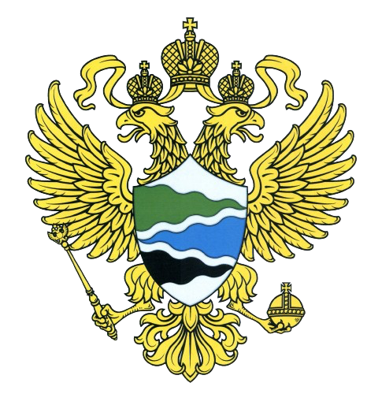
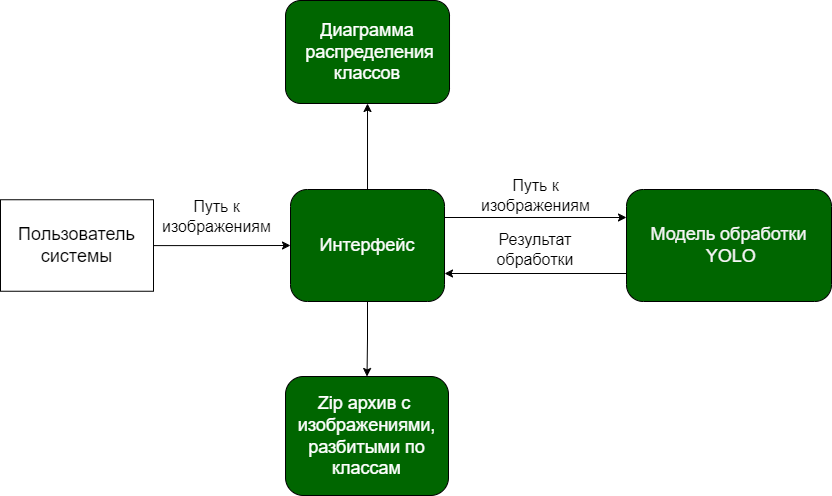

<div align="center">
  
# ЦИФРОВОЙ ПРОРЫВ <br> Классификация парнокопытных



</div> 


## Оглавление
- ### [Задание](#1)
- ### [Решение](#2)
- ### [Запуск кода](#3)
- ### [Уникальность нашего решения](#4)
- ### [Стек](#5)
- ### [Команда](#6)
- ### [Ссылки](#7)

## <a name="1"> Задание </a>

На основе представленных данных, сформированных датасетов и материалов из открытых источников обучить нейросеть отличать вид (подвид) оленя друг от друга, а также сформировать интерфейс загрузки данных и представления результатов распознавания с учетом требования по автономности решения (без использования сети «Интернет»). В настоящее время не все ООПТ оснащены доступом в интернет. Данные с большого количества фотоловушек вручную переносятся на стационарный компьютер и обрабатываются специалистом самостоятельно, что занимает много времени. Задача – автоматизировать работу научного сотрудника, который сейчас занимается детекцией и классификацией собственноручно.

## <a name="2">Решение </a>

### Архетиктура решения

<div align="center">

</div> 

## <a name="3">Запуск кода </a>

### Последовательные шаги для запуска кода:
1. Склонируйте гит репозиторий:
```Bash
git clone https://github.com/wespa4/Hack-Deers.git
cd Hack-Deers
```
2. Скачайте веса для модели детекции https://drive.google.com/drive/folders/1eHfXdKvqGrvHjaF_1w_-Fe3VZPdsrof-?usp=sharing. Переместите веса в папку репозитория.

3. Установите необходимые пакеты:
```Bash
pip install -r ./requirements.txt
```

4. Для запуска интерфейса введите команду:
```Bash
 "путь до python.exe" ./controller.py
  Пример: C:/Users/Имя_пользователя/AppData/Local/Programs/Python/Python310/python.exe ./controller.py
```

## <a name="4">Уникальность нашего решения </a>

1. Высокая скорость обработки изображений на CPU

2. Дополнительный анализ на основе выявленных закономерностей

3. Интуитивный интерфейс, обработка в 2 клика

## <a name="5">Стек </a>
<div align="center">
  &nbsp;
  &nbsp;
  &nbsp;
  &nbsp;
  &nbsp;

</div>

## <a name="6">Команда </a>
*Состав команды "Герои МЛ и Магии"*

- <h4>: @Ubludor, Маслов Денис - Fullstack-developer</h3>
- <h4>: @vseesheoleg, Сивец Олег - CV-engineer</h3>
- <h4>: @Skadar7, Кузнецов Денис - CV-engineer</h3>
- <h4>: @Llaceyne, Гулария Лана - Designer, Frontend-developer</h3>

## <a name="7">Ссылки </a>

- [ссылка на веса модели](https://drive.google.com/drive/folders/1eHfXdKvqGrvHjaF_1w_-Fe3VZPdsrof-?usp=sharing)&nbsp;
- [ссылка на скринкаст](https://drive.google.com/drive/folders/11BADEqlWaA762Ez33jA7ERvHQEqYgAvE?usp=sharing)&nbsp;
